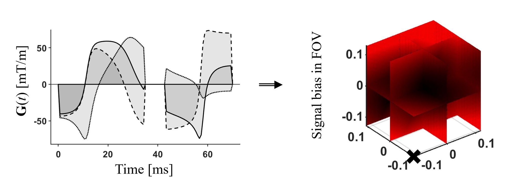

## Concomitant field analysis (CFA)

These tools can be used to predict the impact of concomitant field gradients (Maxwell terms) for arbitrary gradient waveforms.

### Reference
[Szczepankiewicz F, Westin, C-F, Nilsson M. Maxwell-compensated design of asymmetric gradient waveforms for tensor-valued diffusion encoding. Magn Reson Med. 2019;00:1–14. https://doi.org/10.1002/mrm.27828](https://onlinelibrary.wiley.com/doi/full/10.1002/mrm.27828)

### Example figure
